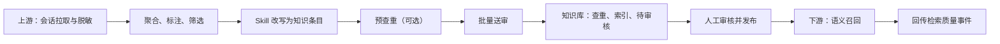

# 知识库自动化接入与召回接口说明

## 1. 适用范围

本文档面向两类系统：

- **上游自动化系统**：拉取答疑会话、脱敏、聚合、标注、筛选、改写后，将候选知识批量送入知识库待审核。
- **下游业务系统**：根据用户问题召回已发布知识，并回传检索质量数据。

知识库负责分类校验、最终查重、向量索引、审核流转和已发布知识召回；上游负责原始会话保存、脱敏、改写和候选筛选。


```mermaid
flowchart LR
    A["上游：会话拉取与脱敏"] --> B["聚合、标注、筛选"]
    B --> C["Skill 改写为知识条目"]
    C --> D["预查重（可选）"]
    D --> E["批量送审"]
    E --> F["知识库：查重、索引、待审核"]
    F --> G["人工审核并发布"]
    G --> H["下游：语义召回"]
    H --> I["回传检索质量事件"]
```

## 2. 基础约定

### 2.1 API 地址

本地开发地址：

```text
http://127.0.0.1:8000/api/v1
```

当前新部署入口（页面与 API 同源）：

```text
http://qa-kb.10.47.193.5.nip.io/api/v1
```

需要外部接入的客户端统一使用该入口；可用 API 由网关路径和接口鉴权控制。

### 2.2 上游自动入库鉴权

除下游召回接口外，自动入库、字典和查重等 `/integration/*` 接口必须携带：

```http
X-Integration-Key: <INTEGRATION_API_KEY>
Content-Type: application/json
```

不要在代码、配置仓库、日志或工单中记录真实密钥。

### 2.3 下游召回鉴权

答疑智能推荐助手调用 `/integration/standard-search` 和
`/integration/retrieval-events:batch` 时，必须在同一个
`X-Integration-Key` 请求头中传入独立的 `RETRIEVAL_API_KEY`。该密钥只允许
标准检索和召回质量反馈，不能调用自动入库、字典或查重接口；
`INTEGRATION_API_KEY` 也不能替代它。内部运营页面使用的 `/knowledge/search`
仍使用平台账号 Bearer 会话，不应将网页登录令牌配置到插件中。

检索请求还必须同时携带插件读取的 `conversationId` 和插件生成的
`requestId`，并在 `X-Conversation-Id`、`X-Request-Id` 请求头中重复传递
完全相同的原值。服务器只负责校验、检索和原样回传，不会生成或改写这两个身份。

### 2.4 通用规则

- 时间字段为 ISO 8601 格式。
- `idempotency_key` 用于安全重试，同一业务事件必须保持不变。
- 单次批量提交最多 100 条。
- `category_id` 必须来自知识库字典接口。
- 候选知识只能进入 `review` 待审核状态，自动化系统不能直接发布。
- 上游只上传脱敏后的证据摘要，不上传原始隐私会话全文。

## 3. 知识语义规则

### 3.1 查重向量

最终查重使用：

```text
主标题 + 正文
```

副标题、分类、层级、场景标签、品牌和机型不参与查重向量，避免结构化元数据或大量副标题干扰重复判断。

### 3.2 召回向量

已发布知识会生成两类检索向量：

- 每个副标题单独生成一个“问法向量”。
- 正文按默认 800 个中文字符分块，分块间保留 120 个字符重叠。

分类等字段用于筛选，不拼入正文语义向量。

## 4. 上游接口

### 4.1 获取分类与标签字典

```http
GET /integration/taxonomy
```

用途：上游在自动标注和改写前获取可用的知识来源、业务类型、`category_id` 和标签维度。
知识层级为“知识来源 → 业务类型 → 知识分类”；两种知识来源目前都支持自营回收、
聚合回收，但每条知识必须分别保存自己的 `knowledge_origin` 和 `business_type`。

响应示例：

```json
{
  "version": "automation-v5",
  "knowledge_origins": [
    {
      "value": "headquarters_standard",
      "label": "总部标准"
    },
    {
      "value": "business_accumulation",
      "label": "业务沉淀"
    }
  ],
  "business_types": [
    {
      "value": "self_operated",
      "label": "自营回收"
    },
    {
      "value": "aggregated",
      "label": "聚合回收"
    }
  ],
  "categories": [
    {
      "id": "cat-qc-standard",
      "name": "质检标准",
      "parent_id": null,
      "level": 1,
      "sort_order": 10
    },
    {
      "id": "cat-qc-process",
      "name": "操作流程",
      "parent_id": null,
      "level": 1,
      "sort_order": 20
    },
    {
      "id": "cat-case-analysis",
      "name": "案例解析",
      "parent_id": null,
      "level": 1,
      "sort_order": 30
    },
    {
      "id": "cat-extra-knowledge",
      "name": "课外常识",
      "parent_id": null,
      "level": 1,
      "sort_order": 40
    }
  ],
  "tag_dimensions": []
}
```

上游应保存 `knowledge_origins[].value` 和 `business_types[].value`，提交知识时传递编码
而不是中文名称。`automation-v5` 相比 v4 新增 `knowledge_origins`；分类和标签字段保持兼容。
预查重、直接候选提交、价值复核候选同步和标准检索均要求显式传递知识来源与业务类型
（标准检索的业务类型仍可由旧上下文推断，但新客户端应明确传递两者）。

### 4.2 预查重

```http
POST /integration/knowledge-dedup:check
```

用途：改写完成后、批量送审前的可选预检查。批量送审时知识库仍会再次查重，因此不能只依赖该接口的结果。

请求示例：

```json
{
  "knowledge": {
    "title": "手机无法开机的排查步骤",
    "subtitles": [
      "设备黑屏且无充电提示如何处理",
      "手机无法启动的客服问法"
    ],
    "content": {
      "blocks": [
        {
          "type": "text",
          "value": "先确认充电器、线材和电源状态；再执行强制重启；仍无法恢复时按售后流程升级处理。"
        }
      ]
    },
    "knowledge_origin": "headquarters_standard",
    "business_type": "self_operated",
    "category_id": "cat-qc-standard",
    "scene_tags": ["无法开机", "售后咨询"],
    "applicable_categories": [],
    "applicable_brands": [],
    "applicable_models": [],
    "evidence_excerpt": "已脱敏的关键事实摘要。"
  }
}
```

编辑已有知识时可增加 `exclude_knowledge_id` 排除自身：

```json
{
  "exclude_knowledge_id": "A-00001",
  "knowledge": {
    "title": "手机无法开机的排查步骤",
    "content": "...",
    "knowledge_origin": "headquarters_standard",
    "business_type": "self_operated",
    "category_id": "cat-qc-standard"
  }
}
```

响应示例：

```json
{
  "action": "review_duplicate",
  "embedding_model": "Qwen/Qwen3-Embedding-0.6B",
  "content_hash": "4b30...",
  "block_threshold": 0.96,
  "review_threshold": 0.88,
  "matches": [
    {
      "knowledge_id": "A-00001",
      "title": "手机开机异常处理规则",
      "status": "published",
      "knowledge_origin": "headquarters_standard",
      "business_type": "self_operated",
      "category_id": "cat-qc-standard",
      "match_type": "semantic",
      "similarity": 0.913421
    }
  ]
}
```

查重只比较同一 `knowledge_origin` + `business_type` 组合下处于待审核或已发布状态的知识。
不同知识来源或业务类型中的相同标题或正文不会互相拦截；`matches[]` 同时返回
`knowledge_origin` 和 `business_type`，供审核时核对命中范围。

`action` 处理规则：

| action | 含义 | 上游动作 |
|---|---|---|
| `create` | 未达到查重审核阈值 | 可以继续批量送审 |
| `review_duplicate` | 存在疑似重复知识 | 可以送审，同时保留 `matches` 供审核人员比较 |
| `block_duplicate` | 内容完全相同或达到拦截阈值 | 不要送审，记录命中的知识 ID |

### 4.3 批量提交候选知识

```http
POST /integration/knowledge-candidates:batch
```

请求体：

```json
{
  "items": [
    {
      "event_id": "qa-20260711-000123",
      "idempotency_key": "sha256:conversation-123:knowledge-1",
      "source": {
        "system": "qa-automation",
        "conversation_id": "conversation-123",
        "conversation_url": "https://source.example/conversations/123",
        "message_ids": ["m-1", "m-2", "m-3"],
        "redaction_status": "redacted"
      },
      "processing": {
        "summary_version": "summary-v1",
        "label_model": "classifier-v2",
        "plugin_name": "knowledge-rewriter",
        "plugin_version": "2026-07-22",
        "prompt_version": "prompt-v3",
        "model_name": "your-model-name"
      },
      "selection": {
        "eligible": true,
        "confidence": 0.92,
        "duplicate_fingerprint": "sha256:upstream-fingerprint",
        "reasons": ["回答完整", "问题可复用", "已完成脱敏"]
      },
      "knowledge": {
        "title": "手机无法开机的排查步骤",
        "subtitles": [
          "设备黑屏且无充电提示如何处理",
          "手机无法启动的客服问法"
        ],
        "content": {
          "blocks": [
            {
              "type": "text",
              "value": "先确认充电器、线材和电源状态；再执行强制重启；仍无法恢复时按售后流程升级处理。"
            }
          ]
        },
        "knowledge_origin": "business_accumulation",
        "business_type": "self_operated",
        "category_id": "cat-qc-standard",
        "scene_tags": ["无法开机", "售后咨询"],
        "applicable_categories": [],
        "applicable_brands": ["品牌示例"],
        "applicable_models": ["机型示例"],
        "evidence_excerpt": "已脱敏的关键事实摘要。"
      }
    }
  ]
}
```

字段说明：

| 字段 | 必填 | 说明 |
|---|---:|---|
| `event_id` | 是 | 上游业务事件 ID |
| `idempotency_key` | 是 | 稳定幂等键；重试时必须相同 |
| `source` | 是 | 来源系统与受控会话定位信息 |
| `processing` | 是 | 聚合、标注、改写过程的版本信息 |
| `processing.plugin_name` | 是 | 执行知识改写的插件名称 |
| `processing.plugin_version` | 是 | 插件版本 |
| `selection.eligible` | 是 | 上游筛选是否允许送审 |
| `selection.confidence` | 是 | 0 到 1 的自动化置信度 |
| `knowledge.title` | 是 | 主标题 |
| `knowledge.subtitles` | 否 | 可检索的用户问法或别名；不要堆砌关键词 |
| `knowledge.content` | 是 | 改写后的知识正文；支持字符串或 `blocks` 富文本结构 |
| `knowledge.knowledge_origin` | 是 | 知识来源编码，只允许 `headquarters_standard` 或 `business_accumulation`；必须来自 `/integration/taxonomy` |
| `knowledge.business_type` | 是 | 业务类型编码，只允许 `self_operated` 或 `aggregated`；必须来自 `/integration/taxonomy` |
| `knowledge.category_id` | 是 | 必须来自 `/integration/taxonomy` |
| `knowledge.evidence_excerpt` | 否 | 不超过 4000 字的脱敏证据摘要 |

兼容期内 CZ 仍接收成对出现的旧字段 `skill_name` 和 `skill_version`；新接入必须发送 `plugin_name` 和 `plugin_version`。

响应示例：

```json
{
  "accepted": 0,
  "review_required": 1,
  "rejected": 0,
  "reused": 0,
  "results": [
    {
      "event_id": "qa-20260711-000123",
      "idempotency_key": "sha256:conversation-123:knowledge-1",
      "status": "review_required",
      "ingestion_id": "ing-xxxxxxxxxxxx",
      "knowledge_id": null,
      "error_code": "DUPLICATE_REVIEW_REQUIRED",
      "error_message": "检测到疑似重复知识，需人工核对后确认提交。 命中 A-00001《手机开机异常处理规则》。",
      "deduplication": {
        "action": "review_duplicate",
        "embedding_model": "Qwen/Qwen3-Embedding-0.6B",
        "content_hash": "4b30...",
        "block_threshold": 0.96,
        "review_threshold": 0.88,
        "matches": [
          {
            "knowledge_id": "A-00001",
            "title": "手机开机异常处理规则",
            "status": "published",
            "business_type": "self_operated",
            "category_id": "cat-qc-standard",
            "match_type": "semantic",
            "similarity": 0.913421
          }
        ]
      }
    }
  ]
}
```

结果状态：

| `results[].status` | 含义 | 上游动作 |
|---|---|---|
| `review_submitted` | 已创建知识并提交待审核 | 保存 `ingestion_id`、`knowledge_id` |
| `review_required` | 疑似重复，尚未创建知识 | 保存 `ingestion_id`，由审核人员比较全部命中项并确认 |
| `reused` | 幂等重试，返回已有处理结果 | 不重复提交 |
| `rejected` | 当前记录未入库 | 根据错误码修复后用新的幂等键重试 |

常见错误码：

| 错误码 | 原因 | 建议处理 |
|---|---|---|
| `CATEGORY_NOT_FOUND` | 分类不存在 | 重新拉取字典并映射正确的 `category_id` |
| `CANDIDATE_NOT_ELIGIBLE` | 上游筛选结果为不可送审 | 不要重试，回到筛选策略处理 |
| `DUPLICATE_BLOCKED` | 命中完全重复或高相似度拦截 | 记录命中知识，停止送审 |
| `DEDUP_UNAVAILABLE` | Embedding 服务不可用 | 指数退避后使用相同幂等键重试 |
| `DEDUP_INVALID_CONTENT` | 正文为空或格式无法规范化 | 修复 `knowledge.content` 后重试 |

> 注意：当查重动作为 `review_duplicate` 时，候选进入价值复核队列并返回
> `review_required`，此时不会提前创建知识。审核人员确认内容确实不同后，再通过
> `candidate-reviews:batch-submit` 完成最终同知识来源与业务类型范围内的查重和知识创建。

### 4.4 同步候选到价值复核队列

Answer Hub 等需要保留模型初标、组员验证和人工例外处理的上游，应使用价值复核队列接口，不要直接创建待发布审核知识：

```http
POST /integration/knowledge-review-candidates:batch
X-Integration-Key: <integration-key>
```

请求体沿用 `IntegrationCandidateBatch`，因此
`knowledge.knowledge_origin` 和 `knowledge.business_type` 均为必填；此外可增加：

```json
{
  "model_review": {
    "status": "topic_initial_reviewed_model",
    "decision": "建议沉淀",
    "knowledge_value": "worthy",
    "reason": "案例证据充分",
    "confidence": 0.93,
    "priority_review": true,
    "provider": "mimo",
    "model_name": "model-name",
    "prompt_version": "prompt-v1",
    "run_id": "run-123"
  },
  "human_review": {
    "knowledge_value": "pending",
    "usability": "pending",
    "modification_notes": "",
    "feedback": "",
    "decision": null,
    "error_type": null,
    "training_eligible": null,
    "notes": null,
    "reviewer": null,
    "reviewed_at": null
  }
}
```

同步响应包含：

| 字段 | 说明 |
|---|---|
| `queued` | 尚未通过门禁，等待主系统人工确认 |
| `ready` | 上游自动门禁或人工验证已经通过，可在主系统批量送审 |
| `rejected` | 上游或人工已明确判定不沉淀 |
| `reused` | 相同业务幂等键已存在；主系统人工保存前允许上游刷新，保存后不再覆盖 |
| `results[].review_status` | `pending`、`ready`、`rejected` 或 `submitted` |

主系统用户端接口需要登录令牌和 `knowledge:submit` 权限：

```http
GET /integration/candidate-reviews
PATCH /integration/candidate-reviews/{ingestion_id}
POST /integration/candidate-reviews:batch-submit
```

候选审核列表会返回 `knowledge_origin` 和 `business_type`。`PATCH` 可修正知识来源和业务类型；
一旦修改标题、正文、知识来源、业务类型或其他查重相关字段，之前的疑似重复确认会失效。

`batch-submit` 只接受 `review_status=ready` 的候选，并统一执行分类校验、同知识来源与业务类型
范围内的 Qwen3 查重、向量保存和知识创建。创建后的知识沿用候选的 `knowledge_origin` 与
`business_type`，
状态仍为 `review`，不会直接发布。

### 4.5 查询入库处理状态

```http
GET /integration/ingestions/{ingestion_id}
```

响应示例：

```json
{
  "id": "ing-xxxxxxxxxxxx",
  "event_id": "qa-20260711-000123",
  "idempotency_key": "sha256:conversation-123:knowledge-1",
  "source_system": "qa-automation",
  "source_conversation_id": "conversation-123",
  "status": "review_submitted",
  "knowledge_id": "A-00001",
  "error_code": null,
  "error_message": null,
  "created_at": "2026-07-11T12:00:00Z",
  "updated_at": "2026-07-11T12:00:00Z"
}
```

该接口用于查询接入结果，不代表人工审核已经发布。审核和发布状态由知识库运营侧处理。

常见的接入记录状态：

| `status` | 含义 |
|---|---|
| `review_submitted` | 已进入正常待审核队列 |
| `review_duplicate` | 已进入待审核队列，且附带疑似重复证据 |

## 5. 下游知识召回接口

### 5.1 答疑智能推荐助手标准知识 Provider

```http
POST /integration/standard-search
X-Integration-Key: <RETRIEVAL_API_KEY>
X-Conversation-Id: 202608100001
X-Request-Id: qa-plugin-202608100001-1
Content-Type: application/json
```

该接口与“答疑智能推荐助手 0.2.2”的 `external-standard-provider` 契约兼容。
服务端只检索 `published` 已发布知识，并分别检索“总部标准”和“业务沉淀”：
每个知识来源最多返回 5 条，合并后最多 10 条。待审核、草稿和已废弃知识不会
出现在响应中。

请求示例：

```json
{
  "conversationId": "202608100001",
  "requestId": "qa-plugin-202608100001-1",
  "normalizedQuestion": "屏幕四周胶条破损怎么判定",
  "knowledgeOrigin": "headquarters_standard",
  "businessType": "self_operated",
  "productType": "手机",
  "model": "iPhone 13",
  "orderInfo": {
    "category": "手机",
    "model": "iPhone 13"
  },
  "partTerms": ["屏幕", "胶条"],
  "phenomenonTerms": ["破损"],
  "categoryIntent": ["外观问题"],
  "limit": 8
}
```

字段说明：

| 字段 | 必填 | 说明 |
|---|---:|---|
| `conversationId` | 是 | 插件从当前页面读取的原始纯数字工单 ID；必须与 `X-Conversation-Id` 完全一致 |
| `requestId` | 是 | 插件生成的单次请求标识；必须与 `X-Request-Id` 完全一致 |
| `normalizedQuestion` | 是 | 插件整理后的检索问题，不能为空 |
| `knowledgeOrigin` | 否 | 兼容旧插件的来源字段；当前接口固定同时检索总部标准和业务沉淀 |
| `businessType` | 否 | 业务类型硬过滤，只允许 `self_operated` 或 `aggregated`；新插件应明确传递 |
| `productType` / `model` | 否 | 插件提供的商品类目和机型上下文 |
| `orderInfo` | 否 | 插件订单上下文，当前保留 `category` 和 `model` |
| `partTerms` / `phenomenonTerms` / `categoryIntent` | 否 | 插件已解析的检索上下文 |
| `limit` | 否 | 每个知识来源的候选上限；兼容 1～20 输入，服务端每组实际最多返回 5 条 |

当前版本只使用 `normalizedQuestion` 生成查询向量，并使用 `businessType` 对已发布
知识执行硬过滤；同一个查询向量会分别在 `headquarters_standard` 和
`business_accumulation` 范围内检索。插件传入的类目和机型是中文名称，而知识库
适用范围保存的是曼哈顿 ID，尚未建立名称到 ID 的稳定映射，因此其他上下文字段
暂不作为硬过滤条件，避免误删正确候选。

为兼容尚未发送 `businessType` 的旧插件，服务端仍会检查 `productType` 和
`orderInfo.category`：任一字段明确等于“聚合回收”时按 `aggregated` 检索，
其他情况默认按 `self_operated` 检索。`knowledgeOrigin` 仍接受旧值，但不再限制
单一来源。

响应示例：

```json
{
  "conversationId": "202608100001",
  "requestId": "qa-plugin-202608100001-1",
  "provider": "knowledge-kb",
  "status": "success",
  "retrievalMode": "semantic_pgvector",
  "knowledgeVersion": "0.1.0",
  "scoreThreshold": 0.42,
  "candidates": [
    {
      "id": "A-00001",
      "title": "手机无法开机的排查步骤",
      "text": "先确认充电器、线材和电源状态；再执行强制重启。",
      "score": 0.912345,
      "finalScore": 0.912345,
      "status": "published",
      "knowledgeOrigin": "headquarters_standard",
      "businessType": "self_operated",
      "categoryId": "cat-qc-standard",
      "level1Label": "质检标准",
      "productType": "phone",
      "models": ["iphone-13"],
      "keywords": ["手机黑屏怎么处理"],
      "sourceRef": "knowledge-kb://knowledge/A-00001"
    }
  ]
}
```

服务器只校验并原样回传插件提交的 `conversationId` 和 `requestId`，不得生成、
替换、截断或重新格式化这两个身份字段。Header 与正文任一字段不一致时返回
HTTP 400。身份字段仅用于关联请求、响应、日志和反馈，不参与召回、过滤、排序或
模型提示词。

能够读取到完整请求身份的业务错误也会在响应最外层原样回传这两个字段。例如，
Header 与正文不一致时返回 `REQUEST_IDENTITY_MISMATCH`，Embedding 服务不可用时
返回 `EMBEDDING_SERVICE_UNAVAILABLE`。缺少字段或字段格式不合法的请求会在进入
业务处理前由参数校验拒绝，因此不承诺回显不完整的身份。

响应按“总部标准 TOP5、业务沉淀 TOP5”的组顺序合并，每组内部按相关性从高到低。
每条候选都会返回实际所属的 `knowledgeOrigin` 和 `businessType`。知识正文会转换为纯文本返回；
图片和视频地址不会下发，但其 `alt`、`caption`
等可读说明会保留。无命中时返回 HTTP 200、`status: "no_match"` 和空
`candidates`。某个知识来源不足 5 条时只返回实际命中数，不会用另一来源补位或
复制结果；当前接口不会跨业务类型扩大检索。服务端会在适用类目、品牌和机型过滤后，
使用当前激活的知识检索阈值过滤低分候选，并通过 `scoreThreshold` 返回本次生效值。
Embedding 服务不可用时返回 HTTP 503。

插件的 Provider 配置示例：

```json
[
  {
    "id": "knowledge-kb",
    "enabled": true,
    "searchUrl": "http://qa-kb.10.47.193.5.nip.io/api/v1/integration/standard-search",
    "apiKeyEnv": "KNOWLEDGE_KB_RETRIEVAL_KEY",
    "authHeader": "X-Integration-Key",
    "authScheme": "",
    "timeoutMs": 15000
  }
]
```

### 5.2 平台账号语义搜索

```http
POST /knowledge/search
```

请求示例：

```json
{
  "query": "手机黑屏无法开机应该怎么排查",
  "category_id": "cat-qc-standard",
  "top_k": 5
}
```

字段说明：

| 字段 | 必填 | 说明 |
|---|---:|---|
| `query` | 是 | 下游用户问题或改写后的检索问题 |
| `category_id` | 否 | 限定分类 |
| `top_k` | 否 | 返回条数，默认 10，最大 50 |
| `tags` | 否 | 标签值 ID 列表；命中其中任一标签的已发布知识才会参与召回 |

响应示例：

```json
{
  "query": "手机黑屏无法开机应该怎么排查",
  "total": 2,
  "results": [
    {
      "id": "A-00001",
      "title": "手机无法开机的排查步骤",
      "content": {
        "blocks": [
          {
            "type": "text",
            "value": "先确认充电器、线材和电源状态；再执行强制重启；仍无法恢复时按售后流程升级处理。"
          }
        ]
      },
      "score": 0.912345,
      "status": "published",
      "category_id": "cat-qc-standard"
    }
  ]
}
```

`score` 是当前查询与该知识最佳副标题向量或正文分块向量的余弦相似度，范围为 0 到 1。它用于排序，不应单独作为业务正确性的绝对判定。

### 5.3 调用建议

1. 下游先根据业务上下文传入 `category_id` 等可确定的过滤条件。
2. 以 `score` 排序取回 `top_k` 条候选知识。
3. 后续接入 Reranker 后，将候选集交由 Reranker 二次排序，再选择最终知识。
4. 将用户是否采纳、人工选择结果和最终得分回传给知识库，用于分析检索质量。

## 6. 下游检索质量回传

### 6.1 批量回传检索事件

```http
POST /integration/retrieval-events:batch
X-Integration-Key: <RETRIEVAL_API_KEY>
Content-Type: application/json
```

该接口与标准检索共用检索专用密钥，不能使用上游自动入库密钥。

请求示例：

```json
{
  "items": [
    {
      "idempotency_key": "qa-plugin:202608100001:retrieval-1",
      "source_system": "agent-runtime",
      "query": "手机黑屏无法开机应该怎么排查",
      "conversation_id": "202608100001",
      "request_id": "qa-plugin-202608100001-1",
      "candidate_count": 5,
      "top_knowledge_id": "A-00001",
      "top_rerank_score": 0.91,
      "score_threshold": 0.75,
      "selected": true,
      "metadata": {
        "source_kind": "reply",
        "retrieval_model": "Qwen/Qwen3-Embedding-0.6B",
        "reranker_model": "reserved",
        "latency_ms": 86
      }
    }
  ]
}
```

响应示例：

```json
{
  "recorded": 1,
  "reused": 0,
  "results": [
    {
      "idempotency_key": "qa-plugin:202608100001:retrieval-1",
      "conversation_id": "202608100001",
      "request_id": "qa-plugin-202608100001-1",
      "status": "recorded",
      "outcome": "accepted",
      "event_id": "rqe-xxxxxxxxxxxx"
    }
  ]
}
```

`conversation_id` 和 `request_id` 必须由插件提供。服务器不会生成或补填这两个
字段；缺少、格式不合法或同一 `idempotency_key` 绑定到另一组身份时，反馈会被
拒绝。历史数据库中的旧匿名记录会保留，但新接口不再接受匿名反馈。

插件用户操作可将 `feedback_type` 设为 `helpful`、`unhelpful` 或 `corrected`；
对应的 `failure_reason` 可使用 `user_unhelpful` 或 `user_correction`。这两个
值只描述人工操作，不改变候选身份或召回排序。

请求中的 `score_threshold` 为兼容字段，不作为最终统计依据。服务器会以当前激活的
知识检索阈值重新判定并保存 `threshold_status` 和 `outcome`，避免插件内置旧阈值
污染召回分析。

`metadata.source_kind` 仍必须为 `reply` 或 `standard`，该字段仅用于来源审计
和幂等身份校验，不再作为召回事件收归的分组条件。
分析和风险复核先按 `conversation_id` 选出整个会话最后一个 `request_id`，
再把该请求下最新的 `reply`、`standard` 底层事件合并为一个逻辑请求。
合并后的候选快照通过 `candidate_origins` 分别保留并展示“总部标准 TOP5”
和“业务沉淀 TOP5”，统计和分页都只计一次请求。训练导入只使用这个最终
逻辑请求的代表事件。新接口缺少 `source_kind`、传入 `combined` 或其他非法
值时会拒绝；`combined` 仅用于保留历史数据库事件和分析接口的合并展示。

`outcome` 判定规则：

| outcome | 条件 |
|---|---|
| `no_candidates` | `candidate_count = 0` |
| `low_score` | 最高重排得分低于 `score_threshold` |
| `not_selected` | 有候选知识但未被选中 |
| `accepted` | 有候选、得分达标且被选中 |

### 6.2 查看检索分析

```http
GET /integration/retrieval-analytics?page=1&page_size=20&start_at=2026-08-12T16:00:00Z&end_at=2026-08-13T16:00:00Z
```

`page` 从 1 开始；`page_size` 支持 1 到 100。分页只作用于待澄清请求列表，
汇总指标始终和列表使用同一时间范围。`start_at`、`end_at` 为可选 ISO 8601
时间，推荐携带 `Z` 或明确时区偏移；范围采用前闭后开 `[start_at, end_at)`。
未传时间参数时保持全量口径。按自然日筛选时，客户端应把本地起始日
`00:00` 和结束日次日 `00:00` 转成 UTC 后提交，确保结束日期整天都被纳入。
同时传入两个边界时，`start_at` 必须早于 `end_at`。

接口先在时间范围内确定每个 `conversation_id` 的最后一个 `request_id`，
再把该请求的两个候选池完整合并。因此，时间段之后的新提问不会挤掉时间段内
的历史提问；同一请求的总部标准池和业务沉淀池也不会因上报时间跨过边界而被拆散。
候选覆盖、阈值通过、采用情况、人工标注、耗时、待澄清总数和分页均按这一
统一口径计算。

该接口面向知识库内部运营人员，需要平台账号的 `knowledge:view` 权限，不使用 `X-Integration-Key`。

返回内容包括各类结果数量、耗时统计和分页后的待澄清请求记录；`time_range`
会回显后端实际使用的 UTC 时间边界。

## 7. 典型调用顺序

### 7.1 上游送审

```text
GET  /integration/taxonomy
POST /integration/knowledge-dedup:check        （可选）
POST /integration/knowledge-candidates:batch
GET  /integration/ingestions/{ingestion_id}    （按需查询）
```

### 7.2 下游召回与反馈

```text
POST /integration/standard-search              （答疑智能推荐助手）
POST /knowledge/search                         （平台账号）
POST /integration/retrieval-events:batch
```

## 8. 安全与数据边界

- 原始会话、手机号、订单号、地址、身份信息等由上游保存，知识库不接收未经脱敏的原文。
- `conversation_url` 必须是受控访问链接，不能使用公网匿名地址。
- 对接方只保存必要的 `knowledge_id`、`ingestion_id` 和事件 ID。
- Embedding、PostgreSQL、Redis 均应保持在服务器内部网络，不对外暴露端口。
- 生产环境只向插件下发 `RETRIEVAL_API_KEY`，并只开放
  `/integration/standard-search` 和 `/integration/retrieval-events:batch`；
  不得把上游 `INTEGRATION_API_KEY` 下发到插件，`/knowledge/search` 继续由
  平台账号会话保护。

## 9. cURL 示例

拉取字典：

```bash
curl -X GET "$KB_BASE_URL/api/v1/integration/taxonomy" \
  -H "X-Integration-Key: $KB_INTEGRATION_KEY"
```

答疑智能推荐助手语义召回：

```bash
curl -X POST "$KB_BASE_URL/api/v1/integration/standard-search" \
  -H "X-Integration-Key: $KB_RETRIEVAL_KEY" \
  -H "X-Conversation-Id: 202608100001" \
  -H "X-Request-Id: qa-plugin-202608100001-1" \
  -H "Content-Type: application/json" \
  -d '{
    "conversationId": "202608100001",
    "requestId": "qa-plugin-202608100001-1",
    "normalizedQuestion": "手机黑屏无法开机应该怎么排查",
    "knowledgeOrigin": "headquarters_standard",
    "businessType": "self_operated",
    "productType": "手机",
    "limit": 5
  }'
```
