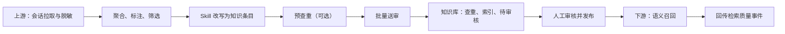

# 知识库自动化接入与召回接口说明

## 1. 适用范围

本文档面向两类系统：

- **上游自动化系统**：拉取答疑会话、脱敏、聚合、标注、筛选、改写后，将候选知识批量送入知识库待审核。
- **下游业务系统**：根据用户问题召回已发布知识，并回传检索质量数据。

知识库负责分类校验、最终查重、向量索引、审核流转和已发布知识召回；上游负责原始会话保存、脱敏、改写和候选筛选。


```mermaid
flowchart LR
    A["上游：会话拉取与脱敏"] --> B["聚合、标注、筛选"]
    B --> C["Skill 改写为知识条目"]
    C --> D["预查重（可选）"]
    D --> E["批量送审"]
    E --> F["知识库：查重、索引、待审核"]
    F --> G["人工审核并发布"]
    G --> H["下游：语义召回"]
    H --> I["回传检索质量事件"]
```

## 2. 基础约定

### 2.1 API 地址

本地开发地址：

```text
http://127.0.0.1:8000/api/v1
```

生产环境请替换为内网域名或反向代理地址，例如：

```text
https://knowledge.example.internal/api/v1
```

### 2.2 上游自动入库鉴权

除下游召回接口外，自动入库、字典和查重等 `/integration/*` 接口必须携带：

```http
X-Integration-Key: <INTEGRATION_API_KEY>
Content-Type: application/json
```

不要在代码、配置仓库、日志或工单中记录真实密钥。

### 2.3 下游召回鉴权

答疑智能推荐助手调用 `/integration/standard-search` 和
`/integration/retrieval-events:batch` 时，必须在同一个
`X-Integration-Key` 请求头中传入独立的 `RETRIEVAL_API_KEY`。该密钥只允许
标准检索和召回质量反馈，不能调用自动入库、字典或查重接口；
`INTEGRATION_API_KEY` 也不能替代它。内部运营页面使用的 `/knowledge/search`
仍使用平台账号 Bearer 会话，不应将网页登录令牌配置到插件中。

### 2.4 通用规则

- 时间字段为 ISO 8601 格式。
- `idempotency_key` 用于安全重试，同一业务事件必须保持不变。
- 单次批量提交最多 100 条。
- `category_id` 必须来自知识库字典接口。
- 候选知识只能进入 `review` 待审核状态，自动化系统不能直接发布。
- 上游只上传脱敏后的证据摘要，不上传原始隐私会话全文。

## 3. 知识语义规则

### 3.1 查重向量

最终查重使用：

```text
主标题 + 正文
```

副标题、分类、层级、场景标签、品牌和机型不参与查重向量，避免结构化元数据或大量副标题干扰重复判断。

### 3.2 召回向量

已发布知识会生成两类检索向量：

- 每个副标题单独生成一个“问法向量”。
- 正文按默认 800 个中文字符分块，分块间保留 120 个字符重叠。

分类等字段用于筛选，不拼入正文语义向量。

## 4. 上游接口

### 4.1 获取分类与标签字典

```http
GET /integration/taxonomy
```

用途：上游在自动标注和改写前获取可用的业务类型、`category_id` 和标签维度。
业务类型是所属分类的上属层级；当前自营回收、聚合回收均复用下方四个知识分类，
但每条知识必须分别保存自己的 `business_type`。

响应示例：

```json
{
  "version": "automation-v4",
  "business_types": [
    {
      "value": "self_operated",
      "label": "自营回收"
    },
    {
      "value": "aggregated",
      "label": "聚合回收"
    }
  ],
  "categories": [
    {
      "id": "cat-qc-standard",
      "name": "质检标准",
      "parent_id": null,
      "level": 1,
      "sort_order": 10
    },
    {
      "id": "cat-qc-process",
      "name": "操作流程",
      "parent_id": null,
      "level": 1,
      "sort_order": 20
    },
    {
      "id": "cat-case-analysis",
      "name": "案例解析",
      "parent_id": null,
      "level": 1,
      "sort_order": 30
    },
    {
      "id": "cat-extra-knowledge",
      "name": "课外常识",
      "parent_id": null,
      "level": 1,
      "sort_order": 40
    }
  ],
  "tag_dimensions": []
}
```

上游应保存 `business_types[].value`，提交知识时传递编码而不是中文名称。
`automation-v4` 相比 v3 新增 `business_types`；分类和标签字段保持兼容。
预查重、直接候选提交和价值复核候选同步不会替上游猜测业务类型，初次提交缺少
`knowledge.business_type` 会返回 HTTP 422。已入队候选未修改业务类型时，
审核 `PATCH` 可以省略该字段。只有下游标准检索为旧插件保留缺省推断，规则见 5.1。

### 4.2 预查重

```http
POST /integration/knowledge-dedup:check
```

用途：改写完成后、批量送审前的可选预检查。批量送审时知识库仍会再次查重，因此不能只依赖该接口的结果。

请求示例：

```json
{
  "knowledge": {
    "title": "手机无法开机的排查步骤",
    "subtitles": [
      "设备黑屏且无充电提示如何处理",
      "手机无法启动的客服问法"
    ],
    "content": {
      "blocks": [
        {
          "type": "text",
          "value": "先确认充电器、线材和电源状态；再执行强制重启；仍无法恢复时按售后流程升级处理。"
        }
      ]
    },
    "business_type": "self_operated",
    "category_id": "cat-qc-standard",
    "scene_tags": ["无法开机", "售后咨询"],
    "applicable_categories": [],
    "applicable_brands": [],
    "applicable_models": [],
    "evidence_excerpt": "已脱敏的关键事实摘要。"
  }
}
```

编辑已有知识时可增加 `exclude_knowledge_id` 排除自身：

```json
{
  "exclude_knowledge_id": "A-00001",
  "knowledge": {
    "title": "手机无法开机的排查步骤",
    "content": "...",
    "business_type": "self_operated",
    "category_id": "cat-qc-standard"
  }
}
```

响应示例：

```json
{
  "action": "review_duplicate",
  "embedding_model": "Qwen/Qwen3-Embedding-0.6B",
  "content_hash": "4b30...",
  "block_threshold": 0.96,
  "review_threshold": 0.88,
  "matches": [
    {
      "knowledge_id": "A-00001",
      "title": "手机开机异常处理规则",
      "status": "published",
      "business_type": "self_operated",
      "category_id": "cat-qc-standard",
      "match_type": "semantic",
      "similarity": 0.913421
    }
  ]
}
```

查重只比较同一 `business_type` 下处于待审核或已发布状态的知识。不同业务类型中的
相同标题或正文不会互相拦截；`matches[].business_type` 用于审核时核对命中范围。

`action` 处理规则：

| action | 含义 | 上游动作 |
|---|---|---|
| `create` | 未达到查重审核阈值 | 可以继续批量送审 |
| `review_duplicate` | 存在疑似重复知识 | 可以送审，同时保留 `matches` 供审核人员比较 |
| `block_duplicate` | 内容完全相同或达到拦截阈值 | 不要送审，记录命中的知识 ID |

### 4.3 批量提交候选知识

```http
POST /integration/knowledge-candidates:batch
```

请求体：

```json
{
  "items": [
    {
      "event_id": "qa-20260711-000123",
      "idempotency_key": "sha256:conversation-123:knowledge-1",
      "source": {
        "system": "qa-automation",
        "conversation_id": "conversation-123",
        "conversation_url": "https://source.example/conversations/123",
        "message_ids": ["m-1", "m-2", "m-3"],
        "redaction_status": "redacted"
      },
      "processing": {
        "summary_version": "summary-v1",
        "label_model": "classifier-v2",
        "plugin_name": "knowledge-rewriter",
        "plugin_version": "2026-07-22",
        "prompt_version": "prompt-v3",
        "model_name": "your-model-name"
      },
      "selection": {
        "eligible": true,
        "confidence": 0.92,
        "duplicate_fingerprint": "sha256:upstream-fingerprint",
        "reasons": ["回答完整", "问题可复用", "已完成脱敏"]
      },
      "knowledge": {
        "title": "手机无法开机的排查步骤",
        "subtitles": [
          "设备黑屏且无充电提示如何处理",
          "手机无法启动的客服问法"
        ],
        "content": {
          "blocks": [
            {
              "type": "text",
              "value": "先确认充电器、线材和电源状态；再执行强制重启；仍无法恢复时按售后流程升级处理。"
            }
          ]
        },
        "business_type": "self_operated",
        "category_id": "cat-qc-standard",
        "scene_tags": ["无法开机", "售后咨询"],
        "applicable_categories": [],
        "applicable_brands": ["品牌示例"],
        "applicable_models": ["机型示例"],
        "evidence_excerpt": "已脱敏的关键事实摘要。"
      }
    }
  ]
}
```

字段说明：

| 字段 | 必填 | 说明 |
|---|---:|---|
| `event_id` | 是 | 上游业务事件 ID |
| `idempotency_key` | 是 | 稳定幂等键；重试时必须相同 |
| `source` | 是 | 来源系统与受控会话定位信息 |
| `processing` | 是 | 聚合、标注、改写过程的版本信息 |
| `processing.plugin_name` | 是 | 执行知识改写的插件名称 |
| `processing.plugin_version` | 是 | 插件版本 |
| `selection.eligible` | 是 | 上游筛选是否允许送审 |
| `selection.confidence` | 是 | 0 到 1 的自动化置信度 |
| `knowledge.title` | 是 | 主标题 |
| `knowledge.subtitles` | 否 | 可检索的用户问法或别名；不要堆砌关键词 |
| `knowledge.content` | 是 | 改写后的知识正文；支持字符串或 `blocks` 富文本结构 |
| `knowledge.business_type` | 是 | 业务类型编码，只允许 `self_operated` 或 `aggregated`；必须来自 `/integration/taxonomy` |
| `knowledge.category_id` | 是 | 必须来自 `/integration/taxonomy` |
| `knowledge.evidence_excerpt` | 否 | 不超过 4000 字的脱敏证据摘要 |

兼容期内 CZ 仍接收成对出现的旧字段 `skill_name` 和 `skill_version`；新接入必须发送 `plugin_name` 和 `plugin_version`。

响应示例：

```json
{
  "accepted": 0,
  "review_required": 1,
  "rejected": 0,
  "reused": 0,
  "results": [
    {
      "event_id": "qa-20260711-000123",
      "idempotency_key": "sha256:conversation-123:knowledge-1",
      "status": "review_required",
      "ingestion_id": "ing-xxxxxxxxxxxx",
      "knowledge_id": null,
      "error_code": "DUPLICATE_REVIEW_REQUIRED",
      "error_message": "检测到疑似重复知识，需人工核对后确认提交。 命中 A-00001《手机开机异常处理规则》。",
      "deduplication": {
        "action": "review_duplicate",
        "embedding_model": "Qwen/Qwen3-Embedding-0.6B",
        "content_hash": "4b30...",
        "block_threshold": 0.96,
        "review_threshold": 0.88,
        "matches": [
          {
            "knowledge_id": "A-00001",
            "title": "手机开机异常处理规则",
            "status": "published",
            "business_type": "self_operated",
            "category_id": "cat-qc-standard",
            "match_type": "semantic",
            "similarity": 0.913421
          }
        ]
      }
    }
  ]
}
```

结果状态：

| `results[].status` | 含义 | 上游动作 |
|---|---|---|
| `review_submitted` | 已创建知识并提交待审核 | 保存 `ingestion_id`、`knowledge_id` |
| `review_required` | 疑似重复，尚未创建知识 | 保存 `ingestion_id`，由审核人员比较全部命中项并确认 |
| `reused` | 幂等重试，返回已有处理结果 | 不重复提交 |
| `rejected` | 当前记录未入库 | 根据错误码修复后用新的幂等键重试 |

常见错误码：

| 错误码 | 原因 | 建议处理 |
|---|---|---|
| `CATEGORY_NOT_FOUND` | 分类不存在 | 重新拉取字典并映射正确的 `category_id` |
| `CANDIDATE_NOT_ELIGIBLE` | 上游筛选结果为不可送审 | 不要重试，回到筛选策略处理 |
| `DUPLICATE_BLOCKED` | 命中完全重复或高相似度拦截 | 记录命中知识，停止送审 |
| `DEDUP_UNAVAILABLE` | Embedding 服务不可用 | 指数退避后使用相同幂等键重试 |
| `DEDUP_INVALID_CONTENT` | 正文为空或格式无法规范化 | 修复 `knowledge.content` 后重试 |

> 注意：当查重动作为 `review_duplicate` 时，候选进入价值复核队列并返回
> `review_required`，此时不会提前创建知识。审核人员确认内容确实不同后，再通过
> `candidate-reviews:batch-submit` 完成最终同业务查重和知识创建。

### 4.4 同步候选到价值复核队列

Answer Hub 等需要保留模型初标、组员验证和人工例外处理的上游，应使用价值复核队列接口，不要直接创建待发布审核知识：

```http
POST /integration/knowledge-review-candidates:batch
X-Integration-Key: <integration-key>
```

请求体沿用 `IntegrationCandidateBatch`，因此
`knowledge.business_type` 仍为必填；此外可增加：

```json
{
  "model_review": {
    "status": "topic_initial_reviewed_model",
    "decision": "建议沉淀",
    "knowledge_value": "worthy",
    "reason": "案例证据充分",
    "confidence": 0.93,
    "priority_review": true,
    "provider": "mimo",
    "model_name": "model-name",
    "prompt_version": "prompt-v1",
    "run_id": "run-123"
  },
  "human_review": {
    "knowledge_value": "pending",
    "usability": "pending",
    "modification_notes": "",
    "feedback": "",
    "decision": null,
    "error_type": null,
    "training_eligible": null,
    "notes": null,
    "reviewer": null,
    "reviewed_at": null
  }
}
```

同步响应包含：

| 字段 | 说明 |
|---|---|
| `queued` | 尚未通过门禁，等待主系统人工确认 |
| `ready` | 上游自动门禁或人工验证已经通过，可在主系统批量送审 |
| `rejected` | 上游或人工已明确判定不沉淀 |
| `reused` | 相同业务幂等键已存在；主系统人工保存前允许上游刷新，保存后不再覆盖 |
| `results[].review_status` | `pending`、`ready`、`rejected` 或 `submitted` |

主系统用户端接口需要登录令牌和 `knowledge:submit` 权限：

```http
GET /integration/candidate-reviews
PATCH /integration/candidate-reviews/{ingestion_id}
POST /integration/candidate-reviews:batch-submit
```

候选审核列表会返回 `business_type`。`PATCH` 可修正业务类型；一旦修改标题、正文、
业务类型或其他查重相关字段，之前的疑似重复确认会失效。

`batch-submit` 只接受 `review_status=ready` 的候选，并统一执行分类校验、同业务
Qwen3 查重、向量保存和知识创建。创建后的知识沿用候选的 `business_type`，
状态仍为 `review`，不会直接发布。

### 4.5 查询入库处理状态

```http
GET /integration/ingestions/{ingestion_id}
```

响应示例：

```json
{
  "id": "ing-xxxxxxxxxxxx",
  "event_id": "qa-20260711-000123",
  "idempotency_key": "sha256:conversation-123:knowledge-1",
  "source_system": "qa-automation",
  "source_conversation_id": "conversation-123",
  "status": "review_submitted",
  "knowledge_id": "A-00001",
  "error_code": null,
  "error_message": null,
  "created_at": "2026-07-11T12:00:00Z",
  "updated_at": "2026-07-11T12:00:00Z"
}
```

该接口用于查询接入结果，不代表人工审核已经发布。审核和发布状态由知识库运营侧处理。

常见的接入记录状态：

| `status` | 含义 |
|---|---|
| `review_submitted` | 已进入正常待审核队列 |
| `review_duplicate` | 已进入待审核队列，且附带疑似重复证据 |

## 5. 下游知识召回接口

### 5.1 答疑智能推荐助手标准知识 Provider

```http
POST /integration/standard-search
X-Integration-Key: <RETRIEVAL_API_KEY>
Content-Type: application/json
```

该接口与“答疑智能推荐助手 0.2.2”的 `external-standard-provider` 契约兼容。
服务端只检索 `published` 已发布知识，并按向量相关性返回最多 5 条；待审核、
草稿和已废弃知识不会出现在响应中。

请求示例：

```json
{
  "normalizedQuestion": "屏幕四周胶条破损怎么判定",
  "businessType": "self_operated",
  "productType": "手机",
  "model": "iPhone 13",
  "orderInfo": {
    "category": "手机",
    "model": "iPhone 13"
  },
  "partTerms": ["屏幕", "胶条"],
  "phenomenonTerms": ["破损"],
  "categoryIntent": ["外观问题"],
  "limit": 8
}
```

字段说明：

| 字段 | 必填 | 说明 |
|---|---:|---|
| `normalizedQuestion` | 是 | 插件整理后的检索问题，不能为空 |
| `businessType` | 否 | 业务类型硬过滤，只允许 `self_operated` 或 `aggregated`；新插件应明确传递 |
| `productType` / `model` | 否 | 插件提供的商品类目和机型上下文 |
| `orderInfo` | 否 | 插件订单上下文，当前保留 `category` 和 `model` |
| `partTerms` / `phenomenonTerms` / `categoryIntent` | 否 | 插件已解析的检索上下文 |
| `limit` | 否 | 兼容插件的 1～20 输入；知识库实际最多返回 5 条 |

当前版本只使用 `normalizedQuestion` 生成查询向量，并使用 `businessType` 对已发布
知识执行硬过滤。插件传入的类目和机型是中文名称，而知识库适用范围保存的是
曼哈顿 ID，尚未建立名称到 ID 的稳定映射，因此其他上下文字段暂不作为硬过滤
条件，避免误删正确候选。

为兼容尚未发送 `businessType` 的旧插件，服务端会检查 `productType` 和
`orderInfo.category`：任一字段明确等于“聚合回收”时按 `aggregated` 检索，
其他情况默认按 `self_operated` 检索。该规则只用于向后兼容，新版本不应依赖推断。

响应示例：

```json
{
  "provider": "knowledge-kb",
  "status": "success",
  "retrievalMode": "semantic_pgvector",
  "knowledgeVersion": "0.1.0",
  "candidates": [
    {
      "id": "A-00001",
      "title": "手机无法开机的排查步骤",
      "text": "先确认充电器、线材和电源状态；再执行强制重启。",
      "score": 0.912345,
      "finalScore": 0.912345,
      "status": "published",
      "businessType": "self_operated",
      "categoryId": "cat-qc-standard",
      "level1Label": "质检标准",
      "productType": "phone",
      "models": ["iphone-13"],
      "keywords": ["手机黑屏怎么处理"],
      "sourceRef": "knowledge-kb://knowledge/A-00001"
    }
  ]
}
```

每条候选都会返回实际所属的 `businessType`。知识正文会转换为纯文本返回；
图片和视频地址不会下发，但其 `alt`、`caption`
等可读说明会保留。无命中时返回 HTTP 200、`status: "no_match"` 和空
`candidates`；无命中只表示当前显式或推断业务类型内没有结果，不会自动跨业务
扩大检索。Embedding 服务不可用时返回 HTTP 503。

插件的 Provider 配置示例：

```json
[
  {
    "id": "knowledge-kb",
    "enabled": true,
    "searchUrl": "https://<知识库地址>/api/v1/integration/standard-search",
    "apiKeyEnv": "KNOWLEDGE_KB_RETRIEVAL_KEY",
    "authHeader": "X-Integration-Key",
    "authScheme": "",
    "timeoutMs": 15000
  }
]
```

### 5.2 平台账号语义搜索

```http
POST /knowledge/search
```

请求示例：

```json
{
  "query": "手机黑屏无法开机应该怎么排查",
  "category_id": "cat-qc-standard",
  "top_k": 5
}
```

字段说明：

| 字段 | 必填 | 说明 |
|---|---:|---|
| `query` | 是 | 下游用户问题或改写后的检索问题 |
| `category_id` | 否 | 限定分类 |
| `top_k` | 否 | 返回条数，默认 10，最大 50 |
| `tags` | 否 | 标签值 ID 列表；命中其中任一标签的已发布知识才会参与召回 |

响应示例：

```json
{
  "query": "手机黑屏无法开机应该怎么排查",
  "total": 2,
  "results": [
    {
      "id": "A-00001",
      "title": "手机无法开机的排查步骤",
      "content": {
        "blocks": [
          {
            "type": "text",
            "value": "先确认充电器、线材和电源状态；再执行强制重启；仍无法恢复时按售后流程升级处理。"
          }
        ]
      },
      "score": 0.912345,
      "status": "published",
      "category_id": "cat-qc-standard"
    }
  ]
}
```

`score` 是当前查询与该知识最佳副标题向量或正文分块向量的余弦相似度，范围为 0 到 1。它用于排序，不应单独作为业务正确性的绝对判定。

### 5.3 调用建议

1. 下游先根据业务上下文传入 `category_id` 等可确定的过滤条件。
2. 以 `score` 排序取回 `top_k` 条候选知识。
3. 后续接入 Reranker 后，将候选集交由 Reranker 二次排序，再选择最终知识。
4. 将用户是否采纳、人工选择结果和最终得分回传给知识库，用于分析检索质量。

## 6. 下游检索质量回传

### 6.1 批量回传检索事件

```http
POST /integration/retrieval-events:batch
X-Integration-Key: <RETRIEVAL_API_KEY>
Content-Type: application/json
```

该接口与标准检索共用检索专用密钥，不能使用上游自动入库密钥。

请求示例：

```json
{
  "items": [
    {
      "idempotency_key": "sha256:conversation-123:retrieval-1",
      "source_system": "agent-runtime",
      "query": "手机黑屏无法开机应该怎么排查",
      "conversation_id": "conversation-123",
      "candidate_count": 5,
      "top_knowledge_id": "A-00001",
      "top_rerank_score": 0.91,
      "score_threshold": 0.75,
      "selected": true,
      "metadata": {
        "retrieval_model": "Qwen/Qwen3-Embedding-0.6B",
        "reranker_model": "reserved",
        "latency_ms": 86
      }
    }
  ]
}
```

响应示例：

```json
{
  "recorded": 1,
  "reused": 0,
  "results": [
    {
      "idempotency_key": "sha256:conversation-123:retrieval-1",
      "status": "recorded",
      "outcome": "accepted",
      "event_id": "rqe-xxxxxxxxxxxx"
    }
  ]
}
```

`outcome` 判定规则：

| outcome | 条件 |
|---|---|
| `no_candidates` | `candidate_count = 0` |
| `low_score` | 最高重排得分低于 `score_threshold` |
| `not_selected` | 有候选知识但未被选中 |
| `accepted` | 有候选、得分达标且被选中 |

### 6.2 查看检索分析

```http
GET /integration/retrieval-analytics
```

该接口面向知识库内部运营人员，需要平台账号的 `knowledge:view` 权限，不使用 `X-Integration-Key`。

返回内容包括各类结果数量和最近 50 条非 `accepted` 风险记录。

## 7. 典型调用顺序

### 7.1 上游送审

```text
GET  /integration/taxonomy
POST /integration/knowledge-dedup:check        （可选）
POST /integration/knowledge-candidates:batch
GET  /integration/ingestions/{ingestion_id}    （按需查询）
```

### 7.2 下游召回与反馈

```text
POST /integration/standard-search              （答疑智能推荐助手）
POST /knowledge/search                         （平台账号）
POST /integration/retrieval-events:batch
```

## 8. 安全与数据边界

- 原始会话、手机号、订单号、地址、身份信息等由上游保存，知识库不接收未经脱敏的原文。
- `conversation_url` 必须是受控访问链接，不能使用公网匿名地址。
- 对接方只保存必要的 `knowledge_id`、`ingestion_id` 和事件 ID。
- Embedding、PostgreSQL、Redis 均应保持在服务器内部网络，不对外暴露端口。
- 生产环境只向插件下发 `RETRIEVAL_API_KEY`，并只开放
  `/integration/standard-search` 和 `/integration/retrieval-events:batch`；
  不得把上游 `INTEGRATION_API_KEY` 下发到插件，`/knowledge/search` 继续由
  平台账号会话保护。

## 9. cURL 示例

拉取字典：

```bash
curl -X GET "$KB_BASE_URL/api/v1/integration/taxonomy" \
  -H "X-Integration-Key: $KB_INTEGRATION_KEY"
```

答疑智能推荐助手语义召回：

```bash
curl -X POST "$KB_BASE_URL/api/v1/integration/standard-search" \
  -H "X-Integration-Key: $KB_RETRIEVAL_KEY" \
  -H "Content-Type: application/json" \
  -d '{
    "normalizedQuestion": "手机黑屏无法开机应该怎么排查",
    "businessType": "self_operated",
    "productType": "手机",
    "limit": 5
  }'
```
