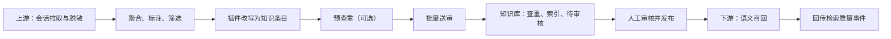

# 知识库自动化接入与召回接口说明

## 1. 适用范围

本文档面向两类系统：

- **上游自动化系统**：拉取答疑会话、脱敏、聚合、标注、筛选、改写后，将候选知识批量送入知识库待审核。
- **下游业务系统**：根据用户问题召回已发布知识，并回传检索质量数据。

知识库负责分类校验、最终查重、向量索引、审核流转和已发布知识召回；上游负责原始会话保存、脱敏、改写和候选筛选。



## 2. 基础约定

### 2.1 API 地址

本地开发地址：

```text
http://127.0.0.1:8000/api/v1
```

生产环境请替换为内网域名或反向代理地址，例如：

```text
https://knowledge.example.internal/api/v1
```

### 2.2 上游鉴权

所有 `/integration/*` 接口必须携带：

```http
X-Integration-Key: <INTEGRATION_API_KEY>
Content-Type: application/json
```

不要在代码、配置仓库、日志或工单中记录真实密钥。

### 2.3 下游召回鉴权

当前已实现的召回接口为 `/knowledge/search`。后端当前未强制校验 `X-Integration-Key`，生产环境必须仅通过内网或 API 网关向受信任下游开放，禁止直接暴露到公网。

### 2.4 通用规则

- 时间字段为 ISO 8601 格式。
- `idempotency_key` 用于安全重试，同一业务事件必须保持不变。
- 单次批量提交最多 100 条。
- `category_id` 必须来自知识库字典接口。
- 候选知识只能进入 `review` 待审核状态，自动化系统不能直接发布。
- 上游只上传脱敏后的证据摘要，不上传原始隐私会话全文。

## 3. 知识语义规则

### 3.1 查重向量

最终查重使用：

```text
主标题 + 正文
```

副标题、分类、层级、场景标签、品牌和机型不参与查重向量，避免结构化元数据或大量副标题干扰重复判断。

自动化批量送审启用语义文本证据门禁：Qwen3的标题和正文相似度达到阈值后，还必须满足标题与正文的有效字符片段重合，或正文存在强文本重合，才会进入语义重复拦截。完全重复和正文包含关系不受该门禁影响。

### 3.2 召回向量

已发布知识会生成两类检索向量：

- 每个副标题单独生成一个“问法向量”。
- 正文按默认 800 个中文字符分块，分块间保留 120 个字符重叠。

分类、层级等字段用于筛选，不拼入正文语义向量。

## 4. 上游接口

### 4.0 第二部分批量接入与无标准改写

```http
POST /integration/second-part/records:batch
```

用途：第二部分把已脱敏记录批量送入CZ，由CZ调用当前第三部分工作流完成原子问题拆分、主题聚合和10项候选改写。

规则：

- 单批最多100条。
- 只接受`redaction_status=redacted`。
- 当前固定为`knowledge_mode=case_only`。
- `standard_references_enabled=false`。
- 候选只依据完整会话、历史实际回复和脱敏案例图生成。
- 相同`idempotency_key`重试返回`reused`，不会再次调用模型。

请求示例见`examples/second_part_batch.example.json`。

### 4.1 获取分类、层级与标签字典

```http
GET /integration/taxonomy
```

用途：上游在自动标注和改写前获取可用的 `category_id`、知识层级和标签维度。

响应示例：

```json
{
  "version": "automation-v1",
  "layers": [
    {
      "value": "L1",
      "label": "通用规则",
      "description": "长期稳定、可重复使用的规则和流程"
    },
    {
      "value": "L2",
      "label": "问题处理",
      "description": "典型问题的排查步骤和解决办法"
    },
    {
      "value": "L3",
      "label": "高频变更",
      "description": "版本、政策或活动等经常更新的内容"
    }
  ],
  "categories": [
    {
      "id": "cat-phone",
      "name": "手机",
      "parent_id": null,
      "level": 1,
      "sort_order": 10
    }
  ],
  "tag_dimensions": []
}
```

### 4.2 预查重

```http
POST /integration/knowledge-dedup:check
```

用途：改写完成后、批量送审前的可选预检查。批量送审时知识库仍会再次查重，因此不能只依赖该接口的结果。

请求示例：

```json
{
  "knowledge": {
    "title": "手机无法开机的排查步骤",
    "subtitles": [
      "设备黑屏且无充电提示如何处理",
      "手机无法启动的客服问法"
    ],
    "content": {
      "blocks": [
        {
          "type": "text",
          "value": "先确认充电器、线材和电源状态；再执行强制重启；仍无法恢复时按售后流程升级处理。"
        }
      ]
    },
    "category_id": "cat-phone",
    "layer": "L2",
    "scene_tags": ["无法开机", "售后咨询"],
    "applicable_business_types": [],
    "applicable_categories": [],
    "applicable_brands": [],
    "applicable_models": [],
    "evidence_excerpt": "已脱敏的关键事实摘要。"
  }
}
```

编辑已有知识时可增加 `exclude_knowledge_id` 排除自身：

```json
{
  "exclude_knowledge_id": "A-00001",
  "knowledge": {
    "title": "手机无法开机的排查步骤",
    "content": "..."
  }
}
```

响应示例：

```json
{
  "action": "review_duplicate",
  "embedding_model": "Qwen/Qwen3-Embedding-0.6B",
  "content_hash": "4b30...",
  "block_threshold": 0.96,
  "review_threshold": 0.88,
  "matches": [
    {
      "knowledge_id": "A-00001",
      "title": "手机开机异常处理规则",
      "status": "published",
      "category_id": "cat-phone",
      "layer": "L2",
      "match_type": "semantic",
      "similarity": 0.913421,
      "title_similarity": 0.925100,
      "content_similarity": 0.913421,
      "title_lexical_similarity": 0.285714,
      "content_lexical_similarity": 0.257143
    }
  ]
}
```

`action` 处理规则：

| action | 含义 | 上游动作 |
|---|---|---|
| `create` | 未达到查重审核阈值，或高语义相似但缺少有效文本重合 | 可以继续批量送审 |
| `review_duplicate` | 达到审核阈值并通过文本证据门禁，或正文存在包含关系 | 可以送审，同时保留`matches`供审核人员比较 |
| `block_duplicate` | 内容完全相同，或达到拦截阈值并通过文本证据门禁 | 不要送审，记录命中的知识ID |

### 4.3 同步候选价值复核队列（当前默认）

```http
POST /integration/knowledge-review-candidates:batch
```

用途：Answer Hub 将聚类后的全部主题候选同步到 CZ 原生“候选价值复核”。
该接口只保存候选和模型/人工复核元数据，不创建正式知识，不执行发布。

与直接送审不同，候选可以带有以下未完成状态：

| 候选状态 | 含义 |
|---|---|
| `pending` | 等待人工确认沉淀价值和可用性 |
| `ready` | 已通过价值门禁，可以批量送审 |
| `rejected` | 不值得沉淀、不可用或人工驳回 |
| `submitted` | 已通过批量送审并创建知识库`review`项 |

自动化 API 的`sync_to_cz_review`默认值为`false`。只有明确开启后，
worker才会把候选同步到CZ；旧字段`submit_to_cz`仅作兼容别名。

请求仍复用`IntegrationCandidate`结构，并额外携带：

```json
{
  "model_review": {
    "knowledge_value": "worthy",
    "confidence": 0.91,
    "priority_review": false,
    "provider": "mimo"
  },
  "human_review": {
    "knowledge_value": "pending",
    "usability": "pending"
  }
}
```

CZ页面使用以下接口进行人工处理：

```http
GET   /integration/candidate-reviews
PATCH /integration/candidate-reviews/{ingestion_id}
POST  /integration/candidate-reviews:batch-submit
```

批量送审请求：

```json
{
  "ingestion_ids": ["ing-001", "ing-002"]
}
```

批量送审最多100条，逐条执行Qwen3查重和写库。只有`ready`候选可以提交；
成功项状态为`review_submitted`或`review_duplicate`，不会自动发布。
若候选原本未进入转写、正文为空，或仍带有已有标准关联搁置信息，
即使人工改判为值得沉淀也会保持`pending`，必须先补齐转写与内容质量初标，
或进入后续标准关联流程。

### 4.4 兼容：直接批量提交候选知识

```http
POST /integration/knowledge-candidates:batch
```

请求体：

```json
{
  "items": [
    {
      "event_id": "qa-20260711-000123",
      "idempotency_key": "sha256:conversation-123:knowledge-1",
      "source": {
        "system": "qa-automation",
        "conversation_id": "conversation-123",
        "conversation_url": "https://source.example/conversations/123",
        "message_ids": ["m-1", "m-2", "m-3"],
        "redaction_status": "redacted"
      },
      "processing": {
        "summary_version": "summary-v1",
        "label_model": "classifier-v2",
        "plugin_name": "answer-hub-topic-transcription",
        "plugin_version": "2026-07-22",
        "prompt_version": "prompt-v3",
        "model_name": "your-model-name"
      },
      "selection": {
        "eligible": true,
        "confidence": 0.92,
        "duplicate_fingerprint": "sha256:upstream-fingerprint",
        "reasons": ["已确认值得沉淀", "回答完整", "问题可复用", "已完成脱敏"]
      },
      "knowledge": {
        "title": "手机无法开机的排查步骤",
        "subtitles": [
          "设备黑屏且无充电提示如何处理",
          "手机无法启动的客服问法"
        ],
        "content": {
          "blocks": [
            {
              "type": "text",
              "value": "先确认充电器、线材和电源状态；再执行强制重启；仍无法恢复时按售后流程升级处理。"
            }
          ]
        },
        "category_id": "cat-phone",
        "layer": "L2",
        "scene_tags": ["无法开机", "售后咨询"],
        "applicable_business_types": [],
        "applicable_categories": [],
        "applicable_brands": ["品牌示例"],
        "applicable_models": ["机型示例"],
        "evidence_excerpt": "已脱敏的关键事实摘要。"
      }
    }
  ]
}
```

字段说明：

| 字段 | 必填 | 说明 |
|---|---:|---|
| `event_id` | 是 | 上游业务事件 ID |
| `idempotency_key` | 是 | 稳定幂等键；重试时必须相同 |
| `source` | 是 | 来源系统与受控会话定位信息 |
| `processing` | 是 | 聚合、标注、改写过程的版本信息 |
| `processing.plugin_name` | 是 | 执行知识改写的插件名称 |
| `processing.plugin_version` | 是 | 插件版本 |
| `selection.eligible` | 是 | 上游筛选是否允许送审；仅“值得沉淀”且通过人工验证或模型自动审核的候选可为 `true` |
| `selection.confidence` | 是 | 0 到 1 的自动化置信度 |
| `knowledge.title` | 是 | 主标题 |
| `knowledge.subtitles` | 否 | 可检索的用户问法或别名；不要堆砌关键词 |
| `knowledge.content` | 是 | 改写后的知识正文；支持字符串或 `blocks` 富文本结构 |
| `knowledge.category_id` | 是 | 必须来自 `/integration/taxonomy` |
| `knowledge.layer` | 是 | `L1`、`L2` 或 `L3` |
| `knowledge.evidence_excerpt` | 否 | 不超过 4000 字的脱敏证据摘要 |

兼容期内CZ仍接收旧字段`skill_name`和`skill_version`，但服务端会统一转换为`plugin_name`和`plugin_version`保存。新接入不得继续发送旧字段。

响应示例：

```json
{
  "accepted": 1,
  "rejected": 0,
  "reused": 0,
  "intercepted": 1,
  "blocked": 0,
  "results": [
    {
      "event_id": "qa-20260711-000123",
      "idempotency_key": "sha256:conversation-123:knowledge-1",
      "status": "review_submitted",
      "ingestion_id": "ing-xxxxxxxxxxxx",
      "knowledge_id": "A-00001",
      "error_code": null,
      "error_message": null,
      "deduplication": {
        "action": "review_duplicate",
        "matches": []
      }
    }
  ]
}
```

计数说明：

- `accepted`：已经创建CZ待审核知识的总数，其中可能包含疑似重复拦截项。
- `intercepted`：Qwen3查重命中`review_duplicate`，已进入人工终审拦截的数量，是`accepted`的子集。
- `blocked`：Qwen3或精确查重命中`block_duplicate`、未创建知识的数量，是`rejected`的子集。

结果状态：

| `results[].status` | 含义 | 上游动作 |
|---|---|---|
| `review_submitted` | 已创建知识并提交待审核 | 保存 `ingestion_id`、`knowledge_id` |
| `reused` | 幂等重试，返回已有处理结果 | 不重复提交 |
| `rejected` | 当前记录未入库 | 根据错误码修复后用新的幂等键重试 |

常见错误码：

| 错误码 | 原因 | 建议处理 |
|---|---|---|
| `CATEGORY_NOT_FOUND` | 分类不存在 | 重新拉取字典并映射正确的 `category_id` |
| `CANDIDATE_NOT_ELIGIBLE` | 上游筛选结果为不可送审 | 不要重试，回到筛选策略处理 |
| `DUPLICATE_BLOCKED` | 命中完全重复或高相似度拦截 | 记录命中知识，停止送审 |
| `DEDUP_UNAVAILABLE` | Embedding 服务不可用 | 指数退避后使用相同幂等键重试 |
| `DEDUP_INVALID_CONTENT` | 正文为空或格式无法规范化 | 修复 `knowledge.content` 后重试 |

> 注意：当查重动作为 `review_duplicate` 时，返回记录仍是 `review_submitted`，具体疑似重复信息在 `deduplication` 中。

### 4.5 查询入库处理状态

```http
GET /integration/ingestions/{ingestion_id}
```

响应示例：

```json
{
  "id": "ing-xxxxxxxxxxxx",
  "event_id": "qa-20260711-000123",
  "idempotency_key": "sha256:conversation-123:knowledge-1",
  "source_system": "qa-automation",
  "source_conversation_id": "conversation-123",
  "status": "review_submitted",
  "knowledge_id": "A-00001",
  "error_code": null,
  "error_message": null,
  "created_at": "2026-07-11T12:00:00Z",
  "updated_at": "2026-07-11T12:00:00Z"
}
```

该接口用于查询接入结果，不代表人工审核已经发布。审核和发布状态由知识库运营侧处理。

常见的接入记录状态：

| `status` | 含义 |
|---|---|
| `review_submitted` | 已进入正常待审核队列 |
| `review_duplicate` | 已进入待审核队列，且附带疑似重复证据 |

## 5. 下游知识召回接口

### 5.1 语义搜索已发布知识

```http
POST /knowledge/search
```

请求示例：

```json
{
  "query": "手机黑屏无法开机应该怎么排查",
  "category_id": "cat-phone",
  "layer": "L2",
  "top_k": 5
}
```

字段说明：

| 字段 | 必填 | 说明 |
|---|---:|---|
| `query` | 是 | 下游用户问题或改写后的检索问题 |
| `category_id` | 否 | 限定分类 |
| `layer` | 否 | 限定知识层级：`L1`、`L2`、`L3` |
| `top_k` | 否 | 返回条数，默认 10，最大 50 |
| `tags` | 否 | 标签值 ID 列表；命中其中任一标签的已发布知识才会参与召回 |

响应示例：

```json
{
  "query": "手机黑屏无法开机应该怎么排查",
  "total": 2,
  "results": [
    {
      "id": "A-00001",
      "title": "手机无法开机的排查步骤",
      "content": {
        "blocks": [
          {
            "type": "text",
            "value": "先确认充电器、线材和电源状态；再执行强制重启；仍无法恢复时按售后流程升级处理。"
          }
        ]
      },
      "score": 0.912345,
      "layer": "L2",
      "status": "published",
      "category_id": "cat-phone"
    }
  ]
}
```

`score` 是当前查询与该知识最佳副标题向量或正文分块向量的余弦相似度，范围为 0 到 1。它用于排序，不应单独作为业务正确性的绝对判定。

### 5.2 调用建议

1. 下游先根据业务上下文传入 `category_id`、`layer` 等可确定的过滤条件。
2. 以 `score` 排序取回 `top_k` 条候选知识。
3. 后续接入 Reranker 后，将候选集交由 Reranker 二次排序，再选择最终知识。
4. 将用户是否采纳、人工选择结果和最终得分回传给知识库，用于分析检索质量。

## 6. 下游检索质量回传

### 6.1 批量回传检索事件

```http
POST /integration/retrieval-events:batch
```

该接口使用 `X-Integration-Key` 鉴权。

请求示例：

```json
{
  "items": [
    {
      "idempotency_key": "sha256:conversation-123:retrieval-1",
      "source_system": "agent-runtime",
      "query": "手机黑屏无法开机应该怎么排查",
      "conversation_id": "conversation-123",
      "candidate_count": 5,
      "top_knowledge_id": "A-00001",
      "top_rerank_score": 0.91,
      "score_threshold": 0.75,
      "selected": true,
      "metadata": {
        "retrieval_model": "Qwen/Qwen3-Embedding-0.6B",
        "reranker_model": "reserved",
        "latency_ms": 86
      }
    }
  ]
}
```

响应示例：

```json
{
  "recorded": 1,
  "reused": 0,
  "results": [
    {
      "idempotency_key": "sha256:conversation-123:retrieval-1",
      "status": "recorded",
      "outcome": "accepted",
      "event_id": "rqe-xxxxxxxxxxxx"
    }
  ]
}
```

`outcome` 判定规则：

| outcome | 条件 |
|---|---|
| `no_candidates` | `candidate_count = 0` |
| `low_score` | 最高重排得分低于 `score_threshold` |
| `not_selected` | 有候选知识但未被选中 |
| `accepted` | 有候选、得分达标且被选中 |

### 6.2 查看检索分析

```http
GET /integration/retrieval-analytics
```

该接口面向知识库内部运营人员，需要平台账号的 `knowledge:view` 权限，不使用 `X-Integration-Key`。

返回内容包括各类结果数量和最近 50 条非 `accepted` 风险记录。

## 7. 典型调用顺序

### 7.1 上游候选复核与送审

```text
POST /integration/second-part/records:batch   （第二部分批量接入并生成主题候选）
GET  /integration/taxonomy
POST /integration/knowledge-review-candidates:batch
GET  /integration/candidate-reviews
PATCH /integration/candidate-reviews/{ingestion_id}
POST /integration/candidate-reviews:batch-submit
GET  /integration/ingestions/{ingestion_id}    （按需查询）
```

`/integration/knowledge-candidates:batch`仍保留作旧客户端兼容入口；新客户端不要绕过
候选价值复核直接调用它。

### 7.2 下游召回与反馈

```text
POST /knowledge/search
POST /integration/retrieval-events:batch
```

## 8. 安全与数据边界

- 原始会话、手机号、订单号、地址、身份信息等由上游保存，知识库不接收未经脱敏的原文。
- `conversation_url` 必须是受控访问链接，不能使用公网匿名地址。
- 对接方只保存必要的 `knowledge_id`、`ingestion_id` 和事件 ID。
- Embedding、PostgreSQL、Redis 均应保持在服务器内部网络，不对外暴露端口。
- 生产环境必须将下游 `/knowledge/search` 置于内网或 API 网关之后。

## 9. cURL 示例

拉取字典：

```bash
curl -X GET "$KB_BASE_URL/api/v1/integration/taxonomy" \
  -H "X-Integration-Key: $KB_INTEGRATION_KEY"
```

语义召回：

```bash
curl -X POST "$KB_BASE_URL/api/v1/knowledge/search" \
  -H "Content-Type: application/json" \
  -d '{
    "query": "手机黑屏无法开机应该怎么排查",
    "category_id": "cat-phone",
    "top_k": 5
  }'
```

## 10. 运行治理和生命周期接口

### 10.1 CZ运营指标

```http
GET /api/v1/operations/metrics
Authorization: Bearer <用户会话Token>
```

返回知识状态、主题审核积压、接入失败、召回接受率、无候选率和平均审核时长。

### 10.2 知识生命周期风险

```http
GET /api/v1/knowledge/lifecycle/overview
Authorization: Bearer <用户会话Token>
```

返回临近失效、已经失效但尚未废弃，以及超过复核周期的知识。

```http
POST /api/v1/operations/lifecycle/apply-expiry
Authorization: Bearer <具备 knowledge:deprecate 权限的用户Token>
```

该接口只处理已发布且 `expires_at` 已到期的知识。

### 10.3 批量保存主题审核结论

```http
POST /api/v1/topic-candidates/review:batch
Authorization: Bearer <具备 topic_review:review 权限的用户Token>
Content-Type: application/json
```

```json
{
  "candidate_ids": ["tpc-001", "tpc-002"],
  "reviewer_decision": "驳回",
  "reviewer_error_type": "证据不足",
  "reviewer_error_reason": "缺少完整会话",
  "reviewer_notes": "",
  "include_in_training": true,
  "redaction_confirmed": true
}
```

批量“通过”只适用于已经设置最终草稿和CZ目标分类的候选；单条失败不会回滚其他候选。

### 10.4 召回质量分析窗口

```http
GET /api/v1/integration/retrieval-analytics?days=30
Authorization: Bearer <用户会话Token>
```

返回接受率、Top1选择率、无候选率、来源系统分布、热门知识和风险查询。
