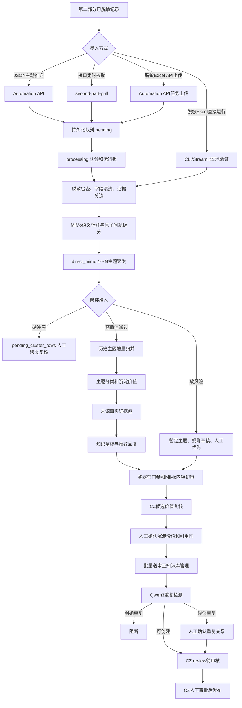

# Answer Hub 端到端全流程与工作流实现报告

> 报告日期：2026-09-14  
> 结论口径：基于当前本地工作区的第一方源码静态梳理。当前分支为 `codex/clustering-dedup-fix-20260902`，Answer Hub 目录存在大量未提交改动；远程仓库最新内容、服务器部署版本和线上运行结果均未核验，不能把本报告描述的本地实现视为“已经上线”。本次未读取 `.env`、真实 `data/outputs` 内容，也未调用 MiMo、CZ、Qwen3 或其他外部服务。

## 一、执行摘要

Answer Hub 的主流程是：从“第二部分”接收已脱敏记录，经持久化队列进入清洗、会话理解、原子问题拆分、1～N 主题聚类、聚类准入、历史主题归并、主题分类与价值判断、知识草稿转写和内容质量初标；然后把主题候选同步到 CZ 的“候选价值复核”。只有人工确认后，CZ 才执行 Qwen3 查重并创建 `review` 待审核知识；最终发布仍需 CZ 人工审批，Answer Hub 不具备自动发布闭环。

最重要的五个结论：

1. 正式无人值守入口是 Automation API/CLI 加持久化文件队列，Streamlit 只是本地准确性验证工作台，不是正式送审入口（`prototypes/answer-hub/streamlit_app.py:2391-2468, 4430-4482`）。
2. 核心编排从 `run_automation_pipeline()` 进入 `initial_label_from_workbook()`，后者继续调用预处理、语义标注、主题构建、转写、初审和导出（`prototypes/answer-hub/src/answer_hub/automation.py:569-797`；`prototypes/answer-hub/src/answer_hub/workflow.py:21321-22121`）。
3. `workflow.py` **尚未拆分**：当前本地文件为 22,211 行、837,377 字节，核心入口、聚类、证据包、转写和质量门禁仍集中在同一文件；`automation.py` 仍直接从它导入 `initial_label_from_workbook`（`prototypes/answer-hub/src/answer_hub/automation.py:20-26`）。源码树中不存在 `transcription_service.py`、`evidence_builder.py` 或 `quality_gates.py`。
4. MiMo 负责语义理解、原子问题拆分、主题聚类、主题价值分类、草稿转写和模型初审；Qwen3 由 CZ 在人工批量送审时负责重复检测，两者职责不同，不能互相替代。
5. 当前本地代码已偏离 2026-08-06 的交接文档：软性聚类风险不再全部只写入 `pending_cluster_rows`，而会形成“暂定单主题候选”，跳过后续 MiMo 调用但继续生成规则草稿；完整自动化也会为所有准入主题生成草稿，再交给人工决定沉淀价值。详见第八节。

## 二、全流程总图



## 三、入口、调度与队列

| 入口 | 实现 | 用途与边界 |
| --- | --- | --- |
| Streamlit | `streamlit_app.py` 的 `_render_automation()`、`_render_operations_monitor()`、`_render_generation()`、`_render_review()` | 上传脱敏 Excel、观察阶段、做聚类/转写/初审准确性验证和人工反馈；调用 `run_automation_pipeline(..., standards_path=None)`，页面明确不直接写入 CZ（`streamlit_app.py:2391-2468, 2619-2650, 4430-4435`）。 |
| CLI | `answer_hub.cli` | `automate` 执行单次全流程；`automation-queue` 扫描无人值守队列；`second-part-pull` 拉取第二部分；另有 `retry-run`、`retry-cz-sync`、`operations-report` 和 `retention-cleanup`（`src/answer_hub/cli.py:120-330, 480-623`）。 |
| Automation API | `create_automation_api_app()` | 提供健康检查、模型配置、调度控制、Excel 任务上传、第二部分 JSON 批量接收、任务查询/重试/产物下载；关键路由为 `POST /api/v1/automation/jobs`、`POST /api/v1/automation/second-part/records:batch`、`GET /api/v1/automation/jobs`（`src/answer_hub/automation_api.py:390-416, 667-925, 927-1015`）。 |
| 兼容 Web | `answer_hub.web` | `/api/preview`、`/api/review-workbook`、`/api/review-queue`、`/api/review-export`，属于本地验证兼容入口，不是当前正式候选同步主链路（`src/answer_hub/web.py:414-479`）。 |

队列由 `AutomationQueue` 管理 `pending / processing / completed / failed / logs` 五个目录。处理器用排他锁防止重复扫描，可把超过阈值的旧 `processing` 文件恢复到 `pending`，逐文件认领并在结束后移动到成功或失败目录；每个来源文件还带 `.job.json` 元数据（`src/answer_hub/automation_queue.py:36-102, 150-249, 625-840`）。单条文件失败不会阻止队列继续处理其他文件。

第二部分有两条接入链路：

- 主动推送：`POST /api/v1/automation/second-part/records:batch` 强制每条记录声明 `redaction_status=redacted`，要求稳定 `idempotency_key`；相同键但内容变化返回 409，相同内容重试复用原任务（`automation_api.py:761-925`）。
- 定时拉取：`SecondPartPullProfile` 用 JSON 配置 URL、分页路径、字段映射、必填字段和工作流选项；`pull_second_part_to_queue()` 映射记录、输出脱敏 Excel 快照、按批次 SHA256 防重复，并在入队/复用后推进 cursor（`second_part_pull.py:135-277, 347-457, 588-780`）。

Windows 调度通过 `AutomationTaskController` 只控制固定计划任务 `AnswerHubAutomationQueue`，支持查询、启停、立即执行和失败重试（`src/answer_hub/automation_control.py:12-15, 62-165`）。`scripts/run_automation_queue.ps1` 会读取执行计划中的沉淀日期，先运行 `second-part-pull`，再运行 `automation-queue`（`scripts/run_automation_queue.ps1:52-124, 140-203`）。

Linux 当前本地草稿脚本 `scripts/run_scheduled_queue.sh` 是另一套边界：固定服务器目录 `/opt/knowledge-kb/prototypes/answer-hub`，发现 `pending/processing/failed` 未解决任务时停止新批次，拉取最多重试三次，成功后再跑队列并同步 CZ（`scripts/run_scheduled_queue.sh:1-46`）。该文件目前未被 Git 跟踪，是否部署、是否由 systemd/timer 调用均未知。

## 四、核心工作流如何实现

核心调用链如下：

```text
run_automation_pipeline
└─ initial_label_from_workbook
   ├─ partition_redaction_rows
   ├─ preprocess_source_rows
   ├─ generate_phone_candidate_rows / extract_topic_feature_rows
   ├─ write_topic_review_workbook
   │  └─ build_topic_review_rows
   │     ├─ _direct_mimo_topic_groups
   │     ├─ _cluster_topic_admission
   │     ├─ TopicRegistry.integrate
   │     ├─ _topic_evidence_package
   │     ├─ MimoClient.classify_topic_stage
   │     ├─ MimoClient.label_topic
   │     ├─ _rule_topic_initial_review / MimoClient.review_topic
   │     └─ _apply_topic_initial_review_guard
   └─ write_topic_candidate_knowledge_workbook
```

各阶段实现：

| 阶段 | 当前代码行为 | 主要证据 |
| --- | --- | --- |
| 1. 输入与脱敏 | 读取 Excel；先做脱敏风险分流，再做品类筛选。缺少聊天且没有图片的记录不能进入模型。 | `workflow.py:21613-21667`；`workflow.py:3357-3360` |
| 2. 预处理 | 统一工单 ID、聊天、图片/视频、核心问题、判定结论；`类目`优先决定产品品类；人工核心问题、产品类型和判定结论保留为结构化证据，冲突强制复核。 | `workflow.py:3323-3500` |
| 3. 会话语义标注 | `extract_topic_feature_rows()` 生成意图、对象/部位、现象、解题方式、置信度和图片需求；MiMo 失败时使用置信度 0.45 的规则特征并标为人工复核。 | `workflow.py:3903-3954, 3957-4029` |
| 4. 原子问题与聚类 | 默认 `direct_mimo`：先去重和本地业务边界预标注，再由 MiMo 将单会话拆为 1～3 个原子问题，并对兼容桶做 1～N 聚类；支持并发、批次拆小、缓存和失败统计。 | `workflow.py:8910-9022, 10318-10442`；`mimo.py:3488-3676, 3761-3819` |
| 5. 聚类准入 | 以 `direct_mimo` 成功、回收业务层级、产品品类、原子/聚类置信度、复核标记和失败/拆分状态做门禁。默认阈值来自 `ANSWER_HUB_CLUSTER_ADMISSION_MIN_CONFIDENCE`，缺省为 0.75。 | `workflow.py:17891-18050, 21360-21387` |
| 6. 历史主题归并 | 仅在准入开启时使用 `TopicRegistry`；只在同业务层级和同品类内比较。高置信复用主题 ID，模糊或命中待审核主题进入人工历史主题复核，同工单不同原子问题不得重新合并。 | `topic_registry.py:935-1158`；`workflow.py:19362-19453` |
| 7. 主题分类与价值 | 先用规则基线，再在安全条件下调用 `MimoClient.classify_topic_stage()`，输出问题分类、沉淀价值、原因、置信度和是否需人工。 | `workflow.py:19596-19684`；`mimo.py:3933-3983` |
| 8. 证据包与转写 | 每个来源事实保留事实 ID、来源记录 ID、人工核心问题、人工结论、聊天、历史回复、图像/视频；代表事实优先覆盖边界、图片、不同结论和完整上下文。随后以规则草稿为底稿，安全时调用 `MimoClient.label_topic()`。 | `workflow.py:11841-12118, 19913-20017` |
| 9. 内容质量门禁 | 先做确定性来源支撑检查，再允许 MiMo 初审。正文/回复中的对象、阈值、动作、因果、范围等无来源内容会写入“主题无来源内容”，确定性失败不能被模型“通过”覆盖。 | `workflow.py:17157-17291, 17420-17819, 20324-20469` |
| 10. 输出与检查点 | 每阶段写工作流检查点，失败恢复时复用已完成的清洗、语义标注或主题结果；生成 `review_queue.xlsx`、`topic_review_queue.xlsx`、`candidate_knowledge.xlsx`、`summary.json` 和审计库。 | `workflow.py:21282-21320, 21951-22121`；`automation.py:804-997` |

## 五、MiMo、Answer Hub、CZ 与 Qwen3 的分工

- **MiMo**：OpenAI 兼容调用客户端，负责理解和生成。`MimoClient`提供可用性预检、会话标注、原子拆分、原子主题聚类、主题价值分类、转写和初审；记录调用量、失败、重试、Token、延迟和估算成本（`mimo.py:3087-3166, 3258-4071`）。模型不可用时，无人值守默认返回 `needs_confirmation`；只有显式 `--continue-on-mimo-unavailable` 才切到规则模式（`automation.py:672-709`）。
- **Answer Hub**：负责数据治理、证据包、聚类边界、人工复核材料、审计和向 CZ 同步，不负责发布。模型配置可来自本机非敏感 JSON，但 API Key 只从环境变量读取，配置接口拒绝写入密钥（`local_model_config.py:71-129, 132-184`）。
- **CZ**：接收 `POST /api/v1/integration/knowledge-review-candidates:batch`，按幂等键保存候选，状态为 `queued/pending`、`ready`、`rejected` 或 `reused`；页面通过候选列表、批量标注、单项编辑和批量送审接口完成人工环节（`backend/app/routes/integration.py:1976-2104, 2244-2464, 2467-2685`）。
- **Qwen3**：CZ 使用 `Qwen/Qwen3-Embedding-0.6B`，默认复核阈值 0.88、阻断阈值 0.96（`backend/app/core/config.py:68-69, 87-88`）。`check_duplicate()`同时检查完全一致、标题一致、正文包含和语义相似，返回 `create / review_duplicate / block_duplicate`（`backend/app/services/knowledge_dedup.py:471-753`）。
- **人工**：候选价值复核先决定是否值得沉淀、是否可用及修改意见；批量送审时 CZ 再次查重。只有 `ready` 候选能创建 `KnowledgeStatus.REVIEW` 知识（`integration.py:2509-2625`）；之后还需具备 `knowledge:approve` 权限的人调用审批接口，状态才从 `review` 变为 `published`（`backend/app/routes/knowledge.py:3832-3867`）。

## 六、审计、运行历史和主要产物

| 产物/存储 | 内容 |
| --- | --- |
| `automation_run.json` | 运行状态、阶段、当前活动、尝试次数、重试历史、告警、SLA、指标和产物路径；由 `AutomationRunStore` 持久化（`automation.py:103-240`）。 |
| `topic_review_queue.xlsx` | 包含 `topic_review_queue`、`topic_source_mapping`、`topic_model_drafts`、`evidence_gap_rows`、`pending_cluster_rows`、`excluded_rows` 和 `guide`（`workflow.py:20597-20708`）。 |
| `candidate_knowledge.xlsx` | 正式本地候选导出门禁要求明确人工通过、沉淀价值通过、模型转写/校验/初审成功且无无来源内容；自动运行初次生成时可能为空。CZ 自动同步实际读取的是 `topic_review_queue.xlsx`（`workflow.py:21144-21279`；`automation_queue.py:418-461`）。 |
| `direct_mimo_progress.json` | 原子提取、聚类和二次归并缓存，支持失败后继续并避免重复模型费用（`workflow.py:6873-7013`）。 |
| 审计 SQLite | `ingestion_records`、`model_runs`、`candidates`、`feedback_events`、`excluded_records`、`topic_registry`、`topic_members`、`topic_merge_events`、`topic_pending_overlays`（`audit.py:51-164`）。 |
| 第二部分状态 | cursor 状态文件、拒绝记录报告、队列 Excel 及 `.job.json` 元数据（`second_part_pull.py:460-585, 670-780`）。 |

运行监管以运行本身为事实来源：队列失败、模型失败、疑似卡住、CZ 同步失败都会形成自动反馈；只有失败后的真实重试成功才标为“已恢复”，人工不能直接把错误改成已解决（`run_history.py:138-219, 243-431`；`run_feedback.py:59-130`；`automation_api.py:971-981`）。

## 七、失败、降级和人工介入

| 情况 | 系统处理 | 人工动作 |
| --- | --- | --- |
| 未脱敏或脱敏高风险 | API拒绝或输入分流，不进入正式模型链路 | 修复脱敏后重新提交 |
| 无聊天且无可用图片 | 进入 `evidence_gap_rows` | 补充可追溯证据 |
| MiMo预检失败 | 默认 `needs_confirmation`；显式允许后规则降级 | 检查模型配置，或确认生成规则草稿 |
| 聚类系统性失败比例达到阈值 | 整批运行失败并禁止同步 CZ | 修复模型/网络后 `retry-run` |
| 业务层级、品类未知或冲突 | 硬阻断，进入 `pending_cluster_rows` | 人工确认归属和聚类 |
| 低置信、模型要求复核、规则降级 | 当前本地代码形成暂定主题，跳过后续 MiMo 分类/转写/初审，生成规则草稿并强制人工优先 | 决定是否合并、是否值得沉淀及如何改稿 |
| 历史主题匹配模糊 | `pending_historical_topic_review`，不写入可信历史主题 | 确认新建还是归并 |
| 无来源陈述、图片缺失、推荐回复不合格 | 确定性门禁改为“需修改”，正式导出阻断 | 补证据或修正文案 |
| CZ 单条校验/写入失败 | 批内其他成功项保留，失败项可幂等重试；可只重试 CZ 同步 | `retry-cz-sync`，无需重跑 MiMo |
| Qwen3不可用 | `DEDUP_UNAVAILABLE`，不绕过查重 | 恢复向量服务后重试 |
| 明确重复/疑似重复 | 明确重复阻断；疑似重复要求人工确认后才能继续 | 查看命中知识并确认差异 |

## 八、当前代码与旧文档的差异及风险

1. **“workflow.py 已拆分”不成立。** 当前核心仍是 22,211 行单文件；虽然引用 `auto_review.py`、`draft_quality.py`、`topic_registry.py` 等辅助模块，但完整编排、证据构造、转写和主要门禁仍在 `workflow.py`。
2. **软性聚类风险处理已变化。** `START_HERE.md` 和 `AI_HANDOFF_LATEST.md` 描述低置信/降级主题统一进入 `pending_cluster_rows`、不进入后续阶段；当前代码把没有业务/品类硬冲突的失败视为 `provisional`，按原子边界形成暂定主题（`workflow.py:18037-18080, 19299-19360`），使用规则分类和规则草稿，不调用后续 MiMo，并强制人工复核（`workflow.py:19618-19662, 19775-19806, 19913-19944, 20439-20443`）。硬冲突才只进入待聚类表并停止（`workflow.py:19537-19551`）。
3. **“仅值得沉淀才转写”已变化。** 正式自动化调用 `write_topic_review_workbook(..., transcribe_all_admitted_topics=True)`（`workflow.py:21969-22004`）；代码会让准入主题继续生成草稿，由人工最终决定价值，个别明确不可复用案例仍跳过（`workflow.py:19774-19821`）。工作簿 guide 也已写明“所有通过聚类准入的主题都会生成候选草稿”（`workflow.py:20587-20590`）。
4. **Linux 调度脚本与“无标准模式”存在冲突风险。** 当前未跟踪的 `run_scheduled_queue.sh:46` 显式传入 `--standards data/standards/active_standards.json`；而当前业务规则要求批量链路不主动读取或生成标准关联。Windows 脚本仅在配置了 `ANSWER_HUB_AUTOMATION_STANDARDS` 时才传入标准（`run_automation_queue.ps1:157-159`）。在正式部署前必须确认服务器实际脚本和参数，不能仅依据文档判断。
5. **Streamlit 提示与预检行为不完全一致。** 页面帮助文字称模型未配置会“自动回退”（`streamlit_app.py:2515-2519`），但 `run_automation_pipeline()` 默认停止并等待确认，除非显式允许继续（`automation.py:676-703`）。
6. **本地工作区不是可直接发布基线。** 报告编写前 Answer Hub 范围有 71 条 Git 状态记录，涵盖修改、删除和未跟踪文件；当前 `workflow.py` 相对 HEAD 增加约 8,742 行、删除约 766 行。上述新行为应先完成代码审查和相关测试，再讨论 PR、合并或服务器更新。

## 九、最终边界

Answer Hub 的责任终点是“把可追溯的主题候选送到 CZ 候选价值复核”，不是发布知识。CZ 人工复核通过后才触发 Qwen3 查重并创建 `review` 待审核知识；CZ 审核人再次审批后才进入 `published`。因此，任何本地运行成功、Excel 已生成、候选已同步或 Qwen3 已通过，都不能单独称为“知识已上线”。
